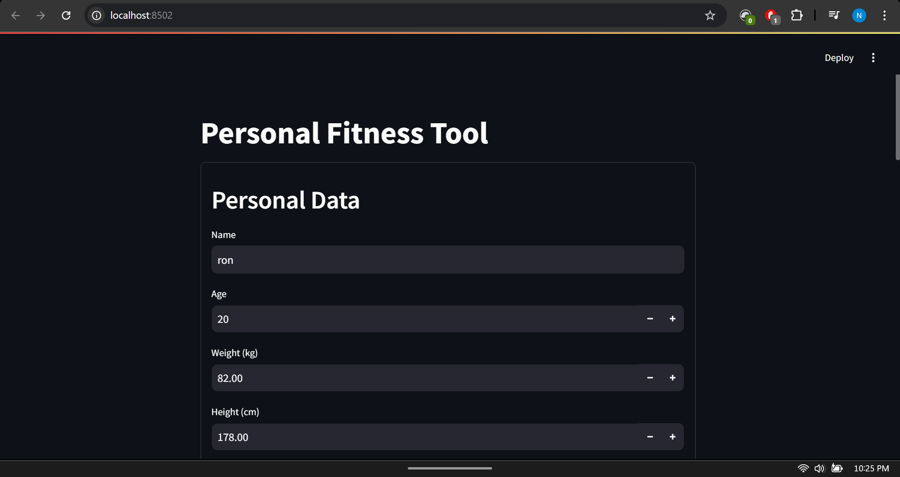
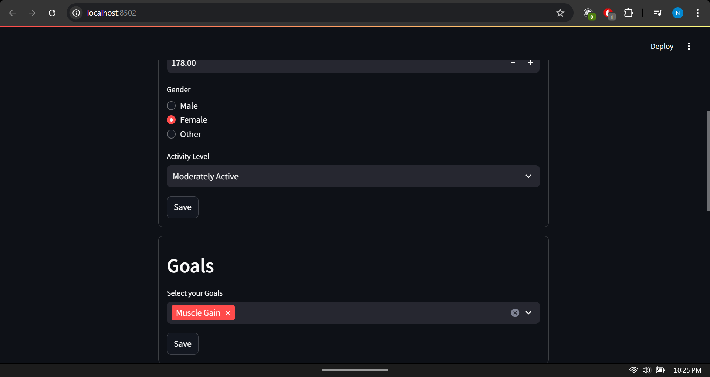
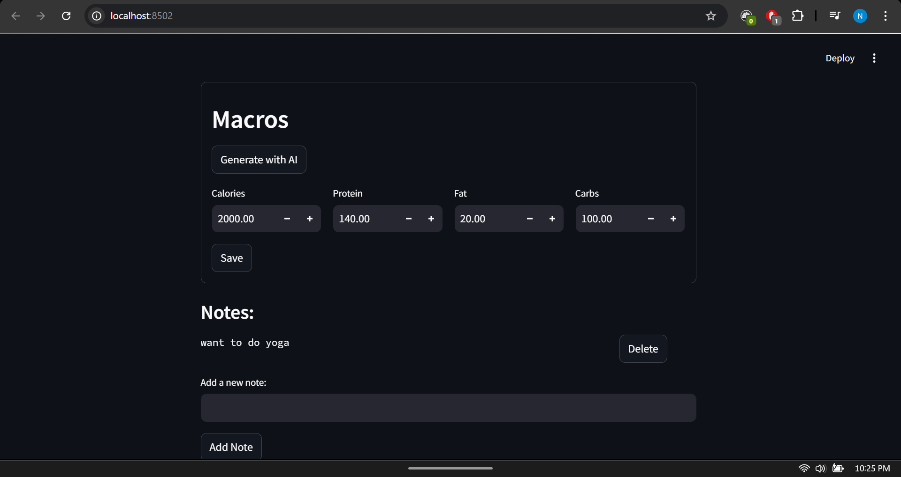
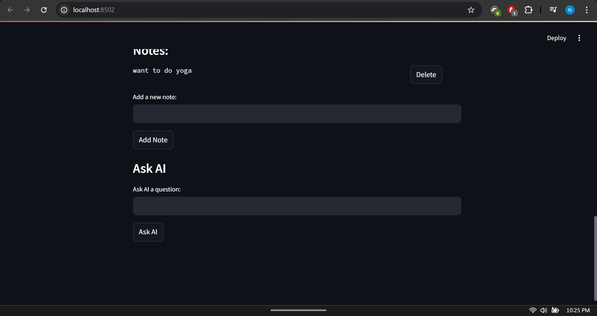

```markdown
# 🌐 AetherNet – AI-Powered Personal Fitness Planner

AetherNet is a smart, interactive **Streamlit** app designed to help users set and track their fitness goals using personalized AI insights. It uses **Langflow (Astra)** to generate dynamic answers and personalized macro recommendations based on user profiles. Data is stored securely using **Astra DB**.

---

## 📸 UI Preview

| Personal Data | Goals Selection |
|---------------|-----------------|
|  |  |

| Macros Panel | Ask AI |
|---------------|--------|
|  |  |

## 🚀 Features

- 🔐 **User Profile Creation** (Name, Age, Weight, Height, Gender, Activity Level)
- 🎯 **Goal Management** (Muscle Gain, Fat Loss, Stay Active)
- 🧮 **Macro Nutrient Calculation via Langflow**
- 📝 **Note Taking System**
- 🤖 **"Ask AI" Section** for general fitness queries (via Langflow AskAIV2)
- 🗄️ **Data Storage** with **Astra DB**
- ⚡ Fast, responsive UI built with **Streamlit fragments**

---

## 🛠️ Tech Stack

- **Frontend:** [Streamlit](https://streamlit.io/)
- **LLM Integration:** [Langflow via Astra API](https://www.langflow.org/)
- **Backend DB:** [Astra DB (DataStax)](https://www.datastax.com/astra)
- **Environment Handling:** `python-dotenv`
- **Language:** Python 3.10+

---

## 📁 File Structure

```

.
├── ai.py                 # Langflow API calls (AskAIV2 & Macros)
├── main.py               # Streamlit app UI
├── profiles.py           # Astra DB integration & profile handling
├── form\_submit.py        # Update profile, notes, macros
├── .env.example          # Example env for deployment
├── requirements.txt      # Python dependencies
├── ASKAIV22.json         # Langflow AskAI flow (export)
├── macros.json           # Langflow Macros flow (export)
├── ui-1.png              # UI Screenshots
├── ui-2.png
├── ui-3.png
├── ui-4.png

````

---

## ⚙️ Setup Instructions

### 🔧 Local Setup

1. **Clone the repo:**
   ```bash
   git clone https://github.com/nyhereo-benzai1/AetherNet.git
   cd AetherNet
````

2. **Create `.env` file:**

   ```bash
   cp .env.example .env
   ```

   Fill in your `.env` with:

   * `BASE_API_URL`
   * `LANGFLOW_ID`
   * `ASKAI_FLOW_ID`
   * `ASKAI_API_TOKEN`
   * `MACROS_FLOW_ID`
   * `MACROS_API_TOKEN`
   * `ASTRA_DB_URL`
   * `ASTRA_DB_TOKEN`
   * `ASTRA_DB_KEYSPACE`

3. **Install dependencies:**

   ```bash
   pip install -r requirements.txt
   ```

4. **Run the app:**

   ```bash
   streamlit run main.py
   ```

---

## ☁️ Deployment (Streamlit Cloud)

1. Push this repo to GitHub (✅ Done).
2. Go to [streamlit.io/cloud](https://streamlit.io/cloud) and deploy from your repo.
3. Add environment secrets from your `.env` in **Streamlit Secrets Manager**.

---

## 🧪 Langflow Flows (Optional)

You can import the included `.json` flows into [Langflow](https://www.langflow.org/) if you want to customize the logic:

* `ASKAIV22.json`
* `macros.json`

---

## 📜 License

This project is licensed under the [MIT License](LICENSE).
Feel free to use, distribute, and modify it!

---

## 🙌 Contributing

Pull requests are welcome. For major changes, please open an issue first to discuss what you’d like to change.

---

## ✨ Author

**Nyhereo (Payal)**
🔗 [GitHub](https://github.com/nyhereo-benzai1)
🖤 Built with love, Streamlit, and Langflow

```

